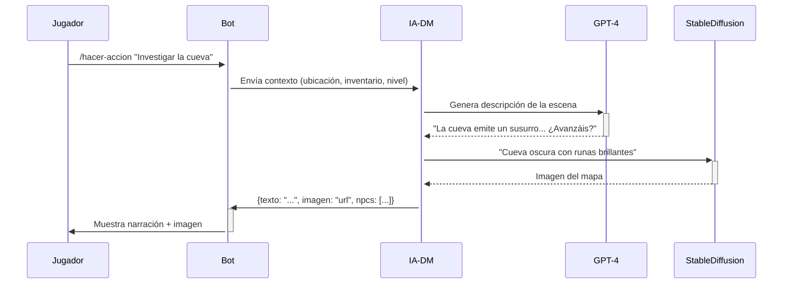

# Documentación: **DM (Dungeon Master) Basado en IA**

**Objetivo**: Un sistema de IA que actúe como _Dungeon Master autónomo_, generando historias, NPCs, mapas, y reaccionando a las acciones de los jugadores en tiempo real.

---

## **1. Arquitectura del DM-IA**

### **1.1 Componentes Clave**

| Módulo                 | Tecnología/API         | Función                                                                        |
| ---------------------- | ---------------------- | ------------------------------------------------------------------------------ |
| **Núcleo Narrativo**   | OpenAI GPT-4           | Genera diálogos, tramas, descripciones de escenas, y misiones.                 |
| **Generador de Mapas** | Stable Diffusion API   | Crea imágenes de mapas y ubicaciones basadas en descripciones textuales.       |
| **NPCs Dinámicos**     | ElevenLabs (TTS)       | Da voz y personalidad única a los NPCs generados.                              |
| **Motor de Decisión**  | Lógica de Árboles + RL | Toma decisiones basadas en el contexto (ej: ajustar dificultad de encuentros). |

### **1.2 Flujo de Interacción**



---

## **2. Funcionalidades Principales del DM-IA**

### **2.1 Generación de Historias Adaptativas**

- **Input**: Acciones de los jugadores, estado del mundo, progreso de la misión.
- **Output**:
  ```json
  {
    "escena": "La princesa NPC revela que el villano está en el Pantano de las Lágrimas.",
    "recompensa": "Mapa del pantano",
    "flag": "villano_revelado: true"
  }
  ```

### **2.2 NPCs con Personalidad y Memoria**

- Cada NPC generado tiene:
  - **Base de datos de interacciones**: Recuerda tratos anteriores con jugadores.
  - **Sistema de afinidad**: Ajusta diálogos según reputación (ej: "Eres mi enemigo... ¡Lárgate!").

### **2.3 Generación de Encuentros Balanceados**

- La IA calcula la dificultad de combate usando:
  ```
  dificultad = (nivel_jugadores × 1.5) + (número_enemigos × 0.8)
  ```
- Ejemplo de encuentro generado:
  ```
  Enemigos: 2 Orcos (Nivel 3), 1 Chaman Oscuro (Nivel 5).
  Dificultad: Media.
  ```

### **2.4 Sistema de Consecuencias Dinámicas**

- Las decisiones de los jugadores afectan el mundo:
  - Ej: "Si roban en la tienda, el dueño contrata cazarecompensas".
  - La IA actualiza las tablas de eventos y diálogos de NPCs.

---

## **3. Integración con el Bot de Discord**

### **3.1 Comandos Específicos para el DM-IA**

| Comando                 | Acción                                                                   |
| ----------------------- | ------------------------------------------------------------------------ |
| `/preguntar-dm [texto]` | La IA responde en-character como DM (ej: "¿Qué hay en el cofre?").       |
| `/forzar-evento [tipo]` | La IA genera un evento aleatorio (ej: "tormenta", "ataque de bandidos"). |
| `/npc-habla [nombre]`   | La IA genera un diálogo para el NPC especificado.                        |

### **3.2 Almacenamiento de Contexto**

- **Base de datos**: MongoDB guarda el estado del mundo en tiempo real:
  ```json
  {
    "mundo": {
      "ubicaciones_descubiertas": ["Cueva del Susurro", "Bosque Sylvano"],
      "eventos_activos": ["eclipse_solar"],
      "npc_relations": {
        "Zoltar": { "reputacion": -10, "misiones_completadas": 2 }
      }
    }
  }
  ```

---

## **4. Requisitos Técnicos**

### **4.1 APIs Externas**

- **OpenAI GPT-4**: Para narrativa y toma de decisiones (≈ $0.06 por 1k tokens).
- **Stable Diffusion**: Generación de imágenes (≈ $0.002 por imagen).
- **ElevenLabs**: Voces de NPCs (≈ $0.30 por 1k caracteres).

### **4.2 Límites y Optimización**

- **Cache de respuestas**: Almacenar descripciones recurrentes (ej: "una taberna estándar") para reducir costos.
- **Prompt engineering**: Guiar a la IA con estructuras claras:
  ```
  Eres un DM de fantasía oscura. Los jugadores están en {ubicación}.
  Sus acciones recientes son: {acciones}.
  Genera una respuesta de 2 párrafos con un giro dramático.
  ```

---

## **5. Ejemplo de Sesión con DM-IA**

**Jugador**: `/preguntar-dm "Inspecciono el altar antiguo"`  
**DM-IA** (voz de ElevenLabs + imagen de Stable Diffusion):

> _"El altar de piedra negra tiene grabados de un ojo sin párpado. De repente, una voz susurra en vuestras mentes: '¿Ofreceréis sangre a cambio de poder?'. En la pared, una figura oscura se materializa..."_

---

## **6. Roadmap de Mejoras Futuras**

1. **IA de voz en tiempo real**: Usar **Amazon Polly** para que el DM hable en el canal de voz de Discord.
2. **Aprendizaje Refuerzo (RL)**: Entrenar un modelo para ajustar la dificultad según el desempeño de los jugadores.
3. **Integración con ChatGPT Plugins**: Permitir que los NPCs accedan a datos externos (ej: clima del mundo en tiempo real).

---
